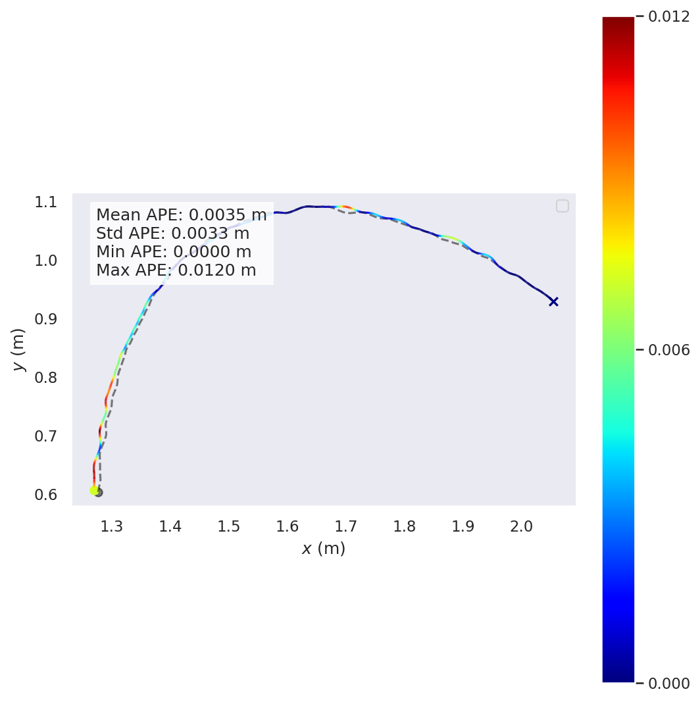

# SKIPP
Repository for the [End-to-end Sketch-Guided Path Planning through Imitation Learning for Autonomous Mobile Robots](https://ieeexplore.ieee.org/document/10924509) paper.

## Prerequisites
It's recommended to work in the dockerized environment, however we do provide steps to reproduce locally. The last tested version worked on:
- Ubuntu 22
- Graphics Card: NVIDIA Quadro RTX 8000
- GPU driver version: 545.23.08

### Getting Started
Clone the repo and download the expert dataset:
```bash
git clone https://github.com/charbel-a-hC/SKIPP.git
cd SKIPP/
```

### Local Dependencies
- Everything should be installed using the Makefile
```bash
make env
```
You also need `Tkinter` installed for the corresponding python3 version:
```bash
sudo apt-get install python3.9-tk
```
### Docker Dependencies
- [Docker](https://docs.docker.com/engine/install/)
- [NVIDIA Container Toolkit](https://docs.nvidia.com/datacenter/cloud-native/container-toolkit/latest/install-guide.html) for GPU support in docker

#### Build the Docker Image
```sh
docker build -t skipp .
```

## Dataset
The dataset can be found on  [Huggingface](https://huggingface.co/datasets/charbel-a-h/SKIPP-Expert-Data), you can download the training or testing data by specifying the value for the argument `data_type` which can be set to `train` or `test`:

```bash
python3 utils/download_dataset.py --data_type <train/test>
```

### Data Description
In the `train` or `test` datasets, there are 2 main directories according to the tasks `L_Shape` and `U_Shape`. In each task there are multiple sequences in different environments where each full sequence `0, 1, 2, ...`  represents the full path of the AMR and the full traversal of that path. 
- `egm`: Image `(256x256x1)` of fused occupancy grid showing the current state of the robot with obstacles shown in white, navigation (free space) area in grey and unseen areas in black.
- `path`: Binary image `(256x256x1)` of the path which is taken by the AMR to reach the target.
- `egm_goal_poses.npy`: Numpy array `(M, 2)` with `M` being the number of states in the sequence and the 3 dimensions showing `x, y`  in pixel coordinates of the target position the AMR should reach.
  
## Demo
We provide pretrained weights for a model for each shape (U-shape and L-shape) also found on huggingface:
- [SKIPP-U-Shape](https://huggingface.co/charbel-a-h/SKIPP-U-Shape)
- [SKIPP-L-Shape](https://huggingface.co/charbel-a-h/SKIPP-L-Shape)

Running the `demo.py` will automatically download the weights into the specified `cache_dir` folder and will run a sample evaluation on the pretrained model:

### Local
```bash
poetry run python3 demo.py --model <skipp-u-shape/skipp-l-shape> --device <cuda,cpu>
```

### Docker
```sh
docker run --rm --gpus all -it -v $(pwd):/SKIPP skipp "poetry run python3 demo.py --model <skipp-u-shape/skipp-l-shape>" --device <cuda,cpu>
```

You should get a sample output:
```bash
{'rmse': 0.004815616734656429, 'mean': 0.003488807276019792, 'median': 0.003108456509546494, 'std': 0.003319395777230308, 'min': 1.7932809118558974e-10, 'max': 0.011985940516812088, 'sse': 0.02316697437056794, 'average_inference': 1114.814043045044, 'batch_fid': 26.23838233947754}
```
and a visual showing the APE of the generated path:


## Running Training
> **Note:** Before mounting the source code to the Docker container (as shown in the command below), make sure to update the `*.config.yaml` file located at `SKIPP/configs` with the following required fields:

```yaml
name: [your run name]
project: [your project name]
entity: [your team or user entity]
```

### Local
```bash
poetry run python3 train_bc.py --config configs/train_bc_sweep.config.yaml
```

### Docker
```sh
docker run --rm --gpus all -it -v $(pwd):/SKIPP skipp "poetry run python3 train_bc.py --config configs/train_bc_sweep.config.yaml"
```

